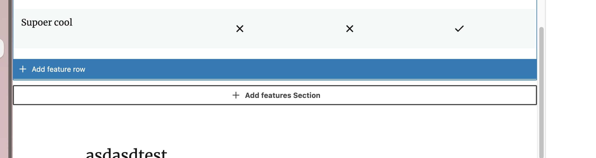
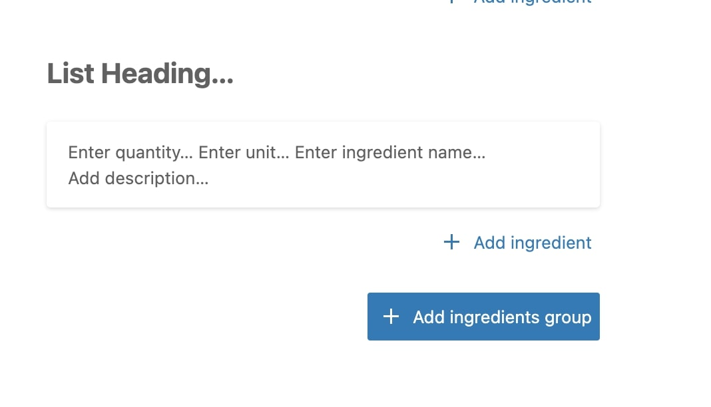

# AppenderButton

Simple Inner block appender button.
This component aim to solve the issue with repeating code for custom appender.
It adds simple Gutenberg `Button` as a appender and allow to pass and override all it's props.
Among with custom class, which will make it easty to control and style it.

[[toc]]
## How to use
To hide component you can use `isSelected` parent prop and conditionally hide or show the button.
This wasn't added to the component itself, as it's better to control it from the parent component.

Saddly I wasn't able to find a way set `className` for the `Inserter` itself. But it can be wrapped into a wrapper and styled any way.

### Props
The component accepts all props that `Button` component accepts, and adds few more:

`clientId` - client id of the block to insert after. This is mandatory prop, without it would not know where to insert the block. (If there is a way to do it without passing it, feel free to update the component :))
`text` - text to display on the button
`onClickButton` - function to run on click after calling `onToggle` function to insert component.


### Example usage

Import:
```jsx
import { AppenderButton } from '..component library path';
```

With: `InnerBlocks`
```js
<InnerBlocks
	allowedBlocks={ALLOWED_INNER_BLOCKS}
	renderAppender={() => <AppenderButton 
			variant="tertiary"
			className="add-group--appender"
			text={__("Add block", "dk-library")}
			clientId={clientId}
		/>
	}
/>
```

With: `innerBlocksProps` and extra logic to show it when any of it's inner block is selected.
```js
import { store as blockEditorStore, useInnerBlocksProps } from '@wordpress/block-editor';
import { useSelect } from '@wordpress/data';

// Rest of the component's code
const { isBlockSelected } = useSelect(
	(select) => {
		const { hasSelectedInnerBlock } = select(blockEditorStore);
		return {
			isBlockSelected: isSelected || hasSelectedInnerBlock(clientId),
		};
	},
	[clientId, isSelected],
);

const appenderControll = () => {
	if (isBlockSelected) {
		return (
			<AppenderButton
				text={__('Add features', 'dk-library')}
				clientId={clientId}
				variant="tertiary"
				className="pricing-table--feature-appender"
			/>
		);
	}
	return null;
};

const innerBlocksProps = useInnerBlocksProps(
		{},
		{
			renderAppender: appenderControll,
		},
	);

// Rest of the code 
return (
	<Fragment>
		<div {...innerBlocksProps} />
	</Fragment>
);
```

### Example Look:

RoomSketcher Pricing Table:


Default Gutenberg buttons:



## TODO:
- [ ] Would be great to find a way to pass `className` to the `Inserter` itself.
- [ ] Inherit `clientId` by default, without need to pass it each time.