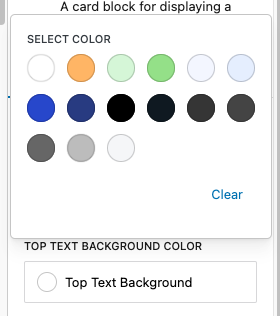
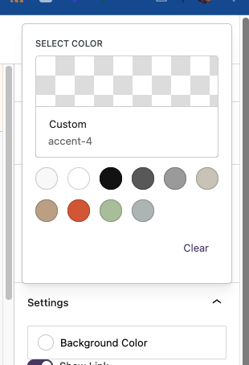

# Color Select Popup
Simple component to select a color from a popup.
It aims to have similar functionality to the default gutenberg picker.




[[toc]]
## Info

You can pass custom colors, by default component is using colors palette from the theme.json file.
Block is ment to be used inside `InspectorControls`

Also the component returns the color object where you can save the slug compared to the default gutenberg picker which returns only the color value, and require later decoding the color object and it is annyoing to use.

Example returned color object from colors.
```jsx
{
    "color": "#111111",
    "name": "Contrast",
    "slug": "contrast"
}
```

If you use custom color true it will return empty strings for slug and name, and only the color value.

```jsx
{
    "color": "#8a3434",
    "slug": "",
    "name": ""
}
```

The component does not have Base controls, it means should be used as in example in usage section.

## Usage

The component accept props from standard `ColorPalette` component from `@wordpress/components` package.
Extra props are:
- `popupLabel`: Allows to add text inside select color popup
- `label`: The text displayed in the control element next to the color indicator.


```jsx
import { BaseControl } from '@wordpress/components';
import { ColorSelectPopup } from '@components/components';

<BaseControl
    id="war-campaign-bottom-text-bg-color"
    label={__('Bottom Text Background Color', 'block-theme')}
>
    <ColorSelectPopup
        label={__('Bottom Text Background', 'block-theme')}
        value={bottomTextBgColor ?? ''}
        onChange={(color) => {
            setAttributes({
                bottomTextBgColor: color.slug,
            });
        }}
        clearable={true}
        disableCustomColors={true}
    />
</BaseControl>
```
