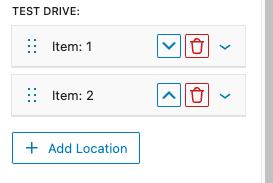
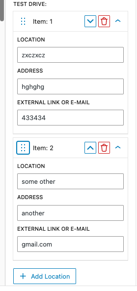
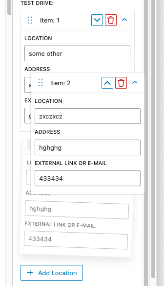

# RepeaterField Component for WordPress Gutenberg

A flexible, reusable repeater component for WordPress Gutenberg blocks that provides drag-and-drop functionality and collapsable.

The example usage can be seen in e.g Nardo Bil 2025 Car sidebar.

[[toc]]
## Screenshots





## Installation

1. Copy the `repeater` file to your block's components directory
2. Import the component in your block's edit function:

```javascript
import RepeaterField from './components/repeater/index.js'; // or any way you like.
```

## Example correct meta schema registration for repeater

The schema has to be accept array of objects, not just array of strings or numbers.

```php
'test_drive_form' => [
	'single'       => true,
	'type'         => 'array',
	'default'      => [],
	'show_in_rest' => [
		'schema' => [
			'type'  => 'array',
			'items' => [
				'type'       => 'object',
				'properties' => [
					'location'  => [
						'type' => 'string',
					],
					'address'   => [
						'type' => 'string',
					],
					'link_text' => [
						'type' => 'string',
					],
				],
			],
		],
	],
],
```

## Basic Usage

```jsx
import { BaseControl, TextControl, TextareaControl, ToggleControl } from '@wordpress/components';

import { RepeaterField } from './components/RepeaterField';

const MyBlockEdit = ({ attributes, setAttributes }) => {
    const { items = [] } = attributes;

    const defaultItemValues = {
        title: '',
        content: '',
        enabled: true
    };

    const renderInnerItem = (item, index, onChange) => {
        return (
            <div>
                <TextControl
                    label="Title"
                    value={item.title || ''}
                    onChange={(title) => onChange({ title })}
                />
                <TextareaControl
                    label="Content"
                    value={item.content || ''}
                    onChange={(content) => onChange({ content })}
                />
                <ToggleControl
                    label="Enabled"
                    checked={item.enabled}
                    onChange={(enabled) => onChange({ enabled })}
                />
            </div>
        );
    };

    return (
        <BaseControl label={__('Test repeater:', 'nardobil')} id="test-repeater">
            <RepeaterField
                value={items}
                onChange={(newItems) => setAttributes({ items: newItems })}
                renderField={renderInnerItem}
                defaultItem={defaultItemValues}
                addButtonText="Add New Item"
                maxItems={10}
                minItems={1}
                defaultCollapsed={false}
                collapsible={true}
                sortable={true}
            />
        </BaseControl>
    );
};
```

## Props

| Prop | Type | Default | Description |
|------|------|---------|-------------|
| `value` | `Array` | `[]` | Array of items to display |
| `onChange` | `Function` | - | Callback function called when items change |
| `renderField` | `Function` | - | Function to render each item's fields |
| `defaultItem` | `Object` | `{}` | Default structure for new items |
| `addButtonText` | `String` | `'Add Item'` | Text for the add button |
| `removeButtonText` | `String` | `'Remove'` | Text for remove buttons |
| `repeaterLabel` | `String` | `'Item'` | Label prefix for each item |
| `maxItems` | `Number` | `null` | Maximum number of items allowed |
| `minItems` | `Number` | `0` | Minimum number of items required |
| `sortable` | `Boolean` | `false` | Enable drag-and-drop sorting |
| `className` | `String` | `''` | Additional CSS class names |

## Advanced Examples

### Media Upload example

```javascript
const renderMediaItem = (item, index, onChange) => {
    const { TextControl, MediaUpload, Button } = wp.components;

    return (
        <div>
            <TextControl
                label="Caption"
                value={item.caption || ''}
                onChange={(caption) => onChange({ caption })}
            />
            <MediaUpload
                onSelect={(media) => onChange({ image: media })}
                allowedTypes={['image']}
                value={item.image?.id}
                render={({ open }) => (
                    <div>
                        {item.image && (
                            
                        )}
                        <Button onClick={open} variant="secondary">
                            {item.image ? 'Change Image' : 'Select Image'}
                        </Button>
                    </div>
                )}
            />
        </div>
    );
};
```

### Nested Repeaters

```javascript
const renderSection = (section, sectionIndex, onSectionChange) => {
    const { TextControl } = wp.components;

    return (
        <div>
            <TextControl
                label="Section Title"
                value={section.title || ''}
                onChange={(title) => onSectionChange({ title })}
            />
            <RepeaterField
                value={section.items || []}
                onChange={(items) => onSectionChange({ items })}
                renderField={(item, itemIndex, onItemChange) => (
                    <TextControl
                        label="Item Name"
                        value={item.name || ''}
                        onChange={(name) => onItemChange({ name })}
                    />
                )}
                defaultItem={{ name: '' }}
                addButtonText="Add Item"
                sortable={true}
            />
        </div>
    );
};
```
## Save Function

The component automatically handles data persistence through Gutenberg's attribute system. In your block's save function, you can access the repeater data:

```javascript
const save = ({ attributes }) => {
    const { repeaterItems } = attributes;

    return (
        <div>
            {repeaterItems.map((item, index) => (
                <div key={index}>
                    <h3>{item.title}</h3>
                    <p>{item.content}</p>
                </div>
            ))}
        </div>
    );
};
```

## Dependencies

- `@wordpress/element` - For React hooks
- `@wordpress/components` - For UI components
- `@wordpress/i18n` - For internationalization
- `@wordpress/icons` - For built-in icons

## Contributing

When contributing to this component:

1. Maintain backwards compatibility
2. Follow WordPress coding standards
3. Test with screen readers for accessibility
4. Update documentation for new features

### TODO:
- Use React's `useMemo` for expensive render operations
- Use better chip for dragging - maybe use `BlockDraggableChip`
- Better UX for up and down.
- More condensed UX without the cards maybe :thinking:

