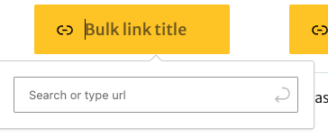
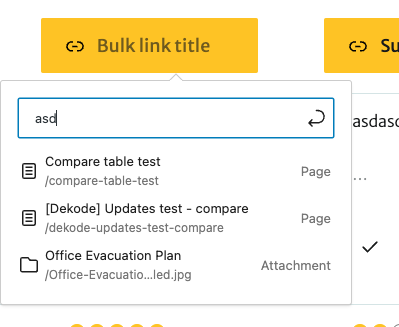
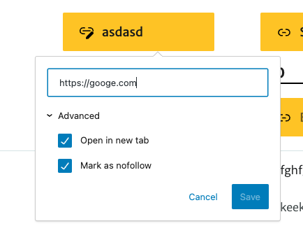
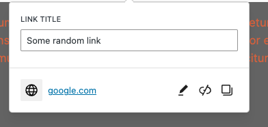

# LinkControl
This component is to solve issue with inline url picking in the editor.

Example look, in This case have styled it as a button, but it does not have to look like this.

Example empty look and clicked:



Example search:



Example with open advanced and custom link and text:




Example with Edit title in link popover:




### Usage:
Most important props to know:

- `linkValue` is the initial value of the link. It should be an object with the same structure as the returned object.
- `onChange` is a function that will be called when the link is changed. It will return an object with the same structure as the returned object.
- `className` is a string that will be added to the main wrapper of the component.
- `showLinkIcon` Whether to show the link icon in the input. Default is `true`.
- {Enum} `editRel` : `['inspector', 'none']`. Enum `['inspector', 'none']`. Whether to show the rel input in the inspector. Default is `inspector`. As `inspector`hook into inspector control, The `none` will not show the input at all.
- `replaceLinkOnSelection` Whether to replace the link title when the link is selected to the page and title exists.
- `editTitle` Enum: `['popover', 'inline', 'none']`. Default: `popover`. Whether to show the link title input in the popover, inline or not at all. As `inline` will use RichEdit to edit link text, but `popover` will use standard input. The `none` will not show the input at all - allows you to handle the title yourself. 
- `isSelected` is a boolean that will be used to determine if the component is in the selected state. This is used to show the popover. So it could be usefully when handling the component as an inline element, not in BlockToolbar.
- `linkSettings` Allows you to override default link settings in advanced tabs. WARNING! This will override all settings in it like new tab, nofollow, rel etc.
- {Function} `prefixEditComponent`    The component to render before the link control.
- {Function} `prefixPopupComponent`   The component to render before the popover.
- {Function} `surfixEditComponent`    The component to render after the link control.

For more details check components props descriptions in the component file.

Example returned Object:
```jsx
{
	title: 'Example',
	url: 'http://example.com',
	linkTarget: '_blank',
	rel: 'noopener noreferrer',
	nofollow: false,
	id: 1,
}
```

#### Example usage:
```jsx
	import { LinkControl } from '..component library path..';
	<LinkControl
		linkValue={column}
		className="my-custom-class-if-needed"
		onChange={(value) => {
			// Do something with the value.
		}}
	/>
```

#### Example full usage:

In this case link is fully specified in the block attributes. But feel free to use separate attributes for each value if needed or skip `properties` in the object.

`block.json`
```json
	...
	"attributes": {
		"link": {
			"type": "object",
			"properties": {
				"id": { // Optional, returned when internal link is selected.
					"type": "Number"
				},
				"url": {
					"type": "string"
				},
				"title": {
					"type": "string"
				},
				"linkTarget": {
					"type": "string"
				},
				"rel": {
					"type": "string"
				}
			}
		}
	}
	...
```

`edit.js`
```jsx
import { LinkControl } from '..component library path..';
// ... other imorts
function Edit({ attributes, setAttributes, isSelected, name }) {
		const {
		link,
	} = attributes;

	// In this case I store everything in Link object, but do not have to. I create a default object to avoid errors.
	const linkValue = {
		rel: '',
		url: '',
		linkTarget: '',
		nofollow: '',
		...link, // This will override the default values if they are set.
	};

	const handleChangeLink = (newLinkValue) => {
		setAttributes({ link: newLinkValue });
	};

	// Added link picker to url and edit title in popover is by default on so I keep it.
	return (
		<>
			<BlockControls>
				<ToolbarGroup>
					<LinkControl
						addRelToInspectorControls 
						linkValue={linkValue}
						onChange={handleChangeLink}
				/>
				</ToolbarGroup>
			</BlockControls>
		</>
	);
}
```

`block.php`
```php
function render( array $attributes, string $content ): string {
	if (isset( $attributes['link'], $attributes['link']['url'] ) ) {
		$link_attr['href']   = \esc_html( $attributes['link']['url'] );
		$link_attr['target'] = \esc_attr( $attributes['link']['linkTarget'] );
		if ( ! empty( $attributes['link']['rel'] ) ) {
			$link_rel               = \esc_attr( $attributes['link']['rel']);
			$link_attr[ $link_rel ] = '';
		}
	}
	// Do something with the link.
}
```

For full example check the `card-template` block in the `dekode-library` plugin.

### TO DO:
 - [ ] Allow slot for the block.
 - [ ] Clean props and desciptions.
 - [ ] Streamline the component - rewrite to separate inline handlers and popover handlers.
 - [ ] Add way to better control popover with custom inner elements (checkboxes if needed).
 - [ ] Add slots for custom elements in the popover.
[[toc]]