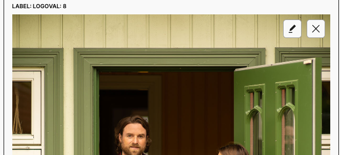
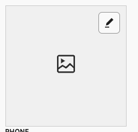
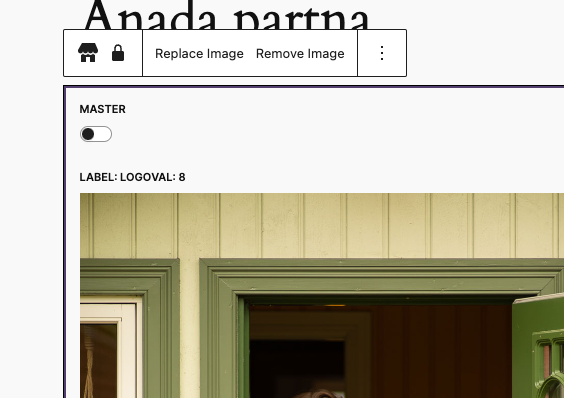
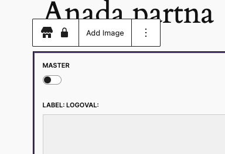
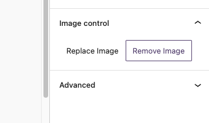
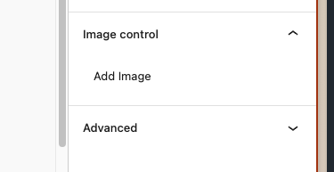
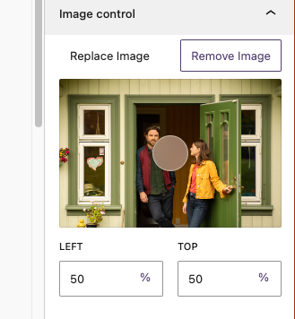

# MediaControl Component

The component aims to solve the never ending issue with media controls. It is a simple component that can be used to control media elements.

The component handles autmatically the upload of media and the selection of media and fetch.

`onSelect` is a callback that is called when a media is selected. It returns an object with the id of the selected media - You can do whatever you want with this.

It is also possible to just remove all the controls and use the component as a simple media element dispaly based on ID.

[[toc]]
## Usage

```jsx
import { MediaControl } from '...components/MediaControl';
const [ focalPoint, setFocalPoint ] = useState({ x: 0.5, y: 0.5 }); // Optionall

<MediaControl
	aspectRatio='1'
	minHeight='200px'
	useFocalPoint={true}
	focalPoint={focalPoint}
	onFocalPointChange={setFocalPoint}
	mediaId={mediaId} // only media ID is needed
	onSelect={({ id }) => { // Example usage of ID as my meta key wanted only ID
		setMeta({ [name]: id });
	}}
/>
```

### Props
- `onSelect` - Callback function that is called when a media is selected.
- `mediaId` - ID of the media to be presented.
- `showCaption` - To show caption or not of the image.
- `aspectRatio` - Aspect ratio of the media presented, use e.g `unset` to remove aspect ratio and display media in original size.
- `minHeight` - Minimum height of the media presented.
- `minWidth` - Minimum width of the media presented.
- `mediaType` - Type of media that can be selected. Default is `['image']`, it uses a `MediaUpload` WP Component and accepts the same props for media types.
- `placeholderUrl` - URL to a placeholder image that is displayed when no media is selected.
- `showInnerControls` - Show inner controls of the media element - inside the frame. Default is `true`.
- `showBlockControls` - Hook into `BlockControls` to add more options for the Gutenberg component, and display controlls over there. Default is `false`.
`showInspectorControls` - Hook into `InspectorControls` to add more options for the Gutenberg component, and display controlls over there. Default is `false`.
- `useFocalPoint` - Use focal point for the image. Default is `false`.
- `focalPoint` - Focal point object of the image. Default is `x:0.5, y:0.5`.
- `onFocalPointChange` - Callback function that is called when focal point is changed. It returns an object with the new focal point - You can do whatever you want with this.
- `className` - Class name for the media element.


### Examples
- With `showInnerControls`




- With `showBlockControls`




- With `showInspectorControls`




- With `useFocalPoint`



### Future Improvements
- Possibility to add custom url for the image from the editor view.
- Add slot for InspectorControls to add more options for the media element if needed.
- Add slot fot BlockControls to add more options for the media element if needed.
- Add slot for Media Inner Controls to add more options for the media element if needed.
- Add propos for custom labels.
- Add way to pass props for native gutenberg elements and return callbacks for them.
- Improve UI/UX of the component Especially BlockControls and InspectorControls.
- Maybe add Focal point editor in popup in case the of multipe isntances of the component in the same view.
