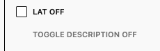

# Meta Checkbox Control

The component set on/off the meta.
This is basic Wrapper for WP `CheckboxControl` component.
But this handles out of the box the save/read meta.



[[toc]]
## Params

```js
* @param {String} metaKey* - The meta key to use for the control (Required).
* @param {Array|String} label - Checkbox label.
* @param {Array|String} help - Checkbox help text.
* @param {Boolean} metaValue - The current meta value.
* @param {String} className - Allow to pass custom class name.
* @param {Function} onChange - Callback after the meta value has been updated.
```

## Example usage:

### PHP

```php
register_post_meta( $post_type_name, 'my_toggle_meta_key', array(
	'type'         => 'boolean',
	'default'      => true,
	'single'       => true,
	'show_in_rest' => true,
) );
```

### Import
```jsx
import { LibMetaCheckboxControl } from "../../../../../components/meta/index.js"; // or where the file is for you.
```

### Usage - basic

Using array as label and help text.
```jsx
<LibMetaCheckboxControl
	label={ [
		__('Title On', 'dekode'),
		__('Title Off', 'dekode'),
	] }
	help={ [
		__('Toggle Description On', 'dekode'),
		__('Toggle Description Off', 'dekode'),
	] }
	metaKey="my_toggle_meta_key"
/>
```

Using string as label and help text - this will be the same for both states.
```jsx
<LibMetaCheckboxControl
	label={ __('Title', 'dekode') }
	help={ __('Toggle Description', 'dekode') }
	metaKey="my_toggle_meta_key"
/>
```

### Nested objects - example

```php
register_post_meta($post_type_name, 'objects', [
	'single'       => true,
	'type'         => 'object',
	'default'      => [],
	'show_in_rest' => [
		'schema' => [
			'type'       => 'object',
			'properties' => [
				'kek' => [
					'type' => 'boolean',
				],
				'mek' => [
					'type' => 'boolean',
				],
				'foo' => [
					'type' => 'object',
					'properties' => [
						'bar' => [
							'type' => 'boolean',
						],
						'zaga' => [
							'type' => 'boolean',
						],
					],
				],
			],
		],
	],
]);
```

```jsx
<LibMetaCheckboxControl
	label={ __('Title', 'dekode') }
	help={ __('Toggle Description', 'dekode') }
	metaKey="objects.foo.bar"
/>
```