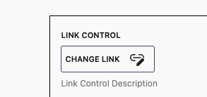
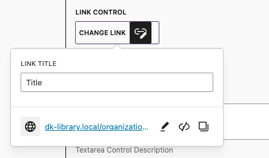
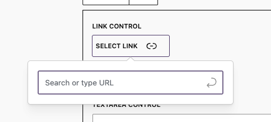

# LibMetaLinkControl

This component is a link control for the WordPress block editor. It allows you to select a link from a list of options.

Selected



Selected and open



Empty and open



### Props

```js
* @param {String} metaKey* - The meta key to use for the control (Required).
* @param {String} label - label.
* @param {String} help - help text.
* @param {Array|String} buttomLabel - Optional way to adjust select button labeling.
* @param {String} className - Allow to pass custom class name.
* @param {Function} onChange - Callback after the meta value has been updated.
```

[[toc]]
## Usage

```jsx
import { LibMetaLinkControl } from '...';

<LibMetaLinkControl
	label={ __('Link Control', 'dekode') }
	help={ __('Link Control Description', 'dekode') }
	metaKey="link_meta"
/>
```

Important: The schema has to be defined as the full link object, or the wp object save meta validation will fail. (Unless this is an nested object, in that case wp does not check the schema)
```php
register_post_meta($post_type_name, 'link_meta', [
		'single'       => true,
		'type'         => 'object',
		'default'      => [],
		'show_in_rest' => [
			'schema' => [
				'type'       => 'object',
				'properties' => [
					'title' => [
						'type' => 'string',
					],
					'url' => [
						'type' => 'string',
					],
					'linkTarget' => [
						'type' => 'string',
					],
					'rel' => [
						'type' => 'string',
					],
					'id' => [
						'type' => 'number',
					],
				],
			],
		],
	]);
```

Example with custom button label
```jsx
import { LibMetaLinkControl } from '...';

<LibMetaLinkControl
	label={ __('Link Control', 'dekode') }
	help={ __('Link Control Description', 'dekode') }
	buttonLabel={ [
		'Select link',
		'Edit link',
	] }
	metaKey="link_meta"
/>
```

## TODO

- [ ] Improve UI/UX
- [ ] Improve accessibility
