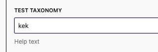
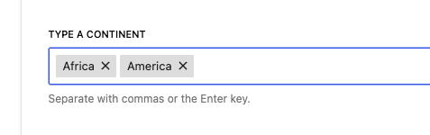

# Meta Checkbox Control: `LibMetaTaxonomyTag`

The `LibMetaTaxonomyTag` component is a wrapper around the `LibMetaCheckboxControl` component. It is used to display a list of checkboxes for a taxonomy.
The coomponent uses simply Gutenberg `FormTokenField` for multiple and `SelectControl` for single term mode.

Single term mode



Single term mode


[[toc]]
## Params

```js
* @param {String} metaKey* - Meta key.
* @param {String} taxonomy* - Taxonomy name.
* @param {Boolean} isMultiple - Allow multiple terms to be selected.
* @param {String} label - Label for the control.
* @param {String} help - Help text for the control.
* @param {String} className - Custom class name.
* @param {Function} onChange - Callback after update meta, if nyou need to do something after meta is updated.
```

## Usage

### As single term picker

```jsx
<LibMetaTaxonomyTag
	label={__('Test Taxonomy', 'dekode')}
	help={__('Help text', 'dekode')}
	taxonomy='organization_cats'
	metaKey="single_category"
/>
```

```php
\register_post_meta($post_type_name, 'single_category', [
	'show_in_rest' => true,
	'single'       => true,
	'type'         => 'string',
]);
```

### As multi term picker

```jsx
<LibMetaTaxonomyTag
	isMultiple={true}
	label={__('Test Taxonomy', 'dekode')}
	help={__('Help text', 'dekode')}
	taxonomy='organization_cats'
	metaKey="multi_category"
/>
```

Keep in mind in this case ih must be an array with numbers
```php
\register_post_meta($post_type_name, 'multi_category', [
	'single'       => true,
	'type'         => 'array',
	'default'      => [],
	'show_in_rest' => [
		'schema' => [
			'type'  => 'array',
			'items' => [
				'type' => 'number',
			],
		],
	]
]);
```