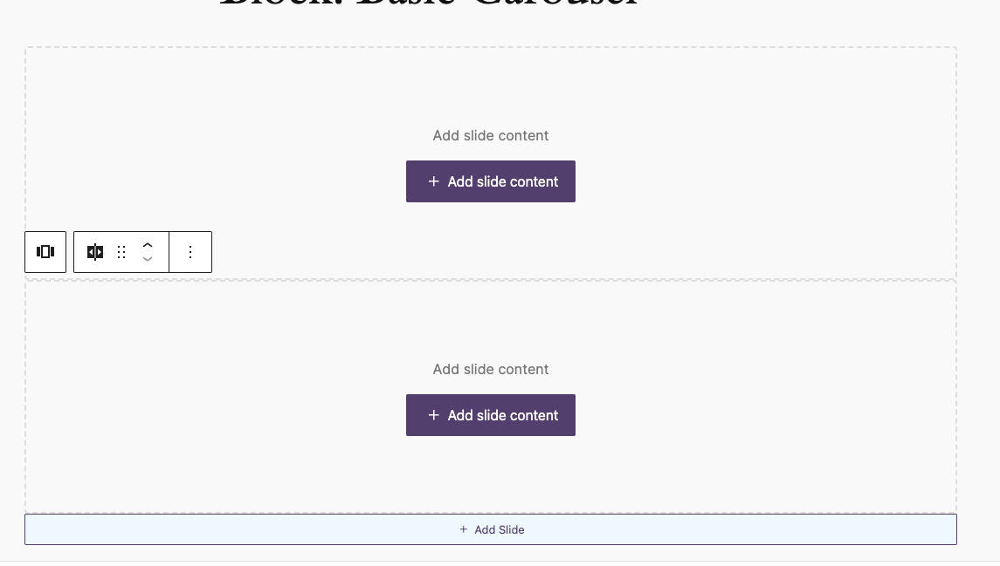

# Basic carousel block


I had no time to finish this block, but I will finish it in the future.
But I wanted to keep the code here so I can come back to it later.

[[toc]]

## 💡 Install via Composer:
```bash
composer require dekode-library/basic-carousel:0.0.1
```

## DO NOT USE THIS BLOCK YET.
I had no time to finish this block, but I will finish it in the future.
But I wanted to keep the code here so I can come back to it later.


## Simple Slider block.
- The block allows user to make simpel carousel
- This block support PHP SSR.
- Dependency: Swiper.

Attribute: `defaultStyle` define if block adds extra class and styling for the carousel, project's dependend.

### Hooks and filters.

#### JS
 - Allowed inner blocks for the slider: `dekode.blocks.carousel.allowed_blocks`
 - Template lock: `dekode.blocks.carousel.template_lock`
 - Template: `dekode.blocks.carousel.template`
 - Carousel controlls UI: `dekode.blocks.carousel.allowed_controlls` allow to filter out controll elements from the carousel. Returns array of attributes what can be controlled.Key has to be same as the attribute name.

#### PHP
 - Filter class list for the render blocks  wrapper `dekode/blocks/carousel/render/class_list`

 ### Potential improvements:
 - Way to override swiper settings from theme level - e.g pass window attributes.
 - Add do_actions for templating of the slider

### This block is not fully Finished yet.
