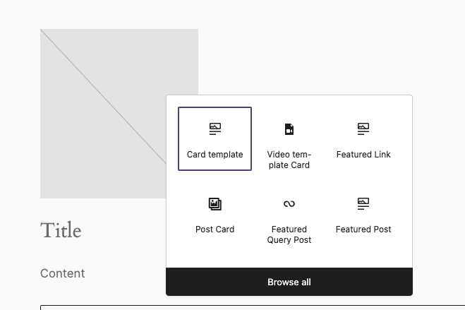

# Card Template


A simple card wrapper that allow to add custom content inside a card.
The idea is to simplify the process of creating a card block with a predefined layout.

By default, the block block does not have any styling.

[[toc]]

## 💡 Install via Composer:
```bash
composer require dekode-library/card-template:2.0.2
```

## Usage
A flexible WordPress Gutenberg block that provides a powerful hook system for extending functionality both in the editor (JavaScript) and on the frontend (PHP). This block serves as a foundation for creating various types of card layouts that can be customized by themes and plugins without any duplication issues.
You can always generate a new variation standard way if the json is not enough - in case of more complex patterns or other needs.
`providerNameSlug` In variation is also used for generating class inside the block in case you need to style it differently.
If not provided the `name` will used instead, but the class will not be created.

## Architecture

## library.json

Here is the example of the `library.json` file that defines the block's structure, variations.
The attributes used in the JS hooks are also auto registered using the `library.json` file as below.
The block will auto register attributes that are different from the default ones.

### Example library.json for variation and custom 
```json
{
		"dekode-library/card-template": {
		"attributes": {
			"providerNameSlug": "post-card-template",
			"allowedInnerBlocks": ["core/paragraph", "core/gallery"],
			"template": [["core/paragraph", {}], ["core/image", {}]],
			"postCardLayout": "mansonry"
		},
		"variations": [
			{
				"name": "video-card",
				"title": "Video template Card",
				"icon": "media-video",
				"description": "A video media card.",
				"attributes": {
					"providerNameSlug": "post-video-variations",
					"allowedInnerBlocks": ["core/embed"],
					"template": [["core/embed", {}]],
					"postCardLayout": "list",
					"onlyForThisvariationAttribute": "foo"
				}
			},
			{
				"name": "post-card",
				"title": "Post Card",
				"icon": "format-gallery",
				"description": "A card block for displaying a post.",
				"attributes": {
					"providerNameSlug": "post-card-variations",
					"allowedInnerBlocks": ["core/paragraph", "core/image"],
					"template": [["core/paragraph", {}]],
					"postCardLayout": "mansonry",
					"templateLock": true
				}
			}
		]
	}
}
```
## JavaScript Hook System

### WordPress Actions

```javascript
// Generic action (fired for all providers)
addAction('dekode-library.card-template.block-loaded', 'my-theme', (blockName, controls, providerNameSlug) => {
    // Add controls for all card types
});

// Provider-specific action - controls automatically filtered to matching blocks
addAction('dekode-library.card-template.block-loaded.post-card-variations', 'my-theme', (blockName, controls, providerNameSlug) => {
    // Add controls only for blocks with providerNameSlug === 'post-card-variations'
    // No manual checking required - filtering is automatic!
});
```

### Available Control APIs

The following APIs are available for adding controls to the block editor:
 - `addInspectorControl`: Add controls to the block's inspector sidebar
 - `addBlockControl`: Add controls to the block toolbar
 - `addBeforeInnerBlocks`: Add content before the inner blocks area
 - `addAfterInnerBlocks`: Add content after the inner blocks area
 - `addWrapperClasses`: Add content before the main wrapper element

#### Inspector Controls
Add panels to the block's inspector (sidebar). Controls are automatically filtered to only appear on blocks with matching `providerNameSlug`:

```javascript
const { addInspectorControl } = controls;

addInspectorControl('my-custom-settings', (props) => {
    const { attributes, setAttributes } = props;
    const { customSetting = 'default' } = attributes;

    // No need to check providerNameSlug - automatic filtering handles this!
    return (
        <PanelBody title={__('Custom Settings')} initialOpen={true}>
            <SelectControl
                label={__('Custom Option')}
                value={customSetting}
                options={[
                    { label: __('Option 1'), value: 'option1' },
                    { label: __('Option 2'), value: 'option2' }
                ]}
                onChange={(value) => setAttributes({ customSetting: value })}
            />
        </PanelBody>
    );
});
```

#### Wrapper Classes
Add CSS classes to the block wrapper in the editor. This provides parity with the PHP wrapper classes hook:
```javascript
const { addWrapperClasses } = controls;

addWrapperClasses('post-layout-classes', (props) => {
    const { attributes } = props;
    const { postLayout = 'grid', showAuthor = false } = attributes;
    
    const classes = [
        `post-card-${postLayout}`,
        showAuthor ? 'has-author' : 'no-author'
    ];
    
    // Can return array of strings or single string
    return classes;
});
```

#### Block Controls
Add toolbar controls to the block. These will only appear on blocks with the matching provider:

```javascript
const { addBlockControl } = controls;

addBlockControl('my-toolbar-button', (props) => {
    // This control automatically only appears on blocks with matching providerNameSlug
    return (
        <ToolbarButton
            icon="admin-customizer"
            label={__('Custom Action')}
            onClick={() => {
                // Handle toolbar action
            }}
        />
    );
});
```

#### Before/After Inner Blocks
Add content before or after the inner blocks area. Provider filtering ensures these only appear on matching blocks:

```javascript
const { addBeforeInnerBlocks, addAfterInnerBlocks } = controls;

addBeforeInnerBlocks('custom-header', (props) => {
    return (
        <div className="custom-block-header">
            <h3>Card Content</h3>
        </div>
    );
});

addAfterInnerBlocks('custom-footer', (props) => {
    const { attributes } = props;
    // This will only render on blocks with matching providerNameSlug
    return (
        <div className="custom-block-footer">
            Status: {attributes.customSetting}
        </div>
    );
});
```

### Complete JavaScript Example

```javascript
import { __ } from '@wordpress/i18n';
import { PanelBody, SelectControl, ToggleControl } from '@wordpress/components';
import { ToolbarButton } from '@wordpress/components';

// Register controls for post card variations
// All controls will automatically only appear on blocks with providerNameSlug === 'post-card-variations'
addAction('dekode-library.card-template.block-loaded.post-card-variations', 'my-theme', (blockName, controls, providerNameSlug) => {
    const { addInspectorControl, addBlockControl, addWrapperClasses, addAfterInnerBlocks, addBeforeInnerBlocks } = controls;

    // No need to check providerNameSlug - automatic filtering handles this!
    
    // Add post-specific inspector controls
    addInspectorControl('post-display-settings', (props) => {
        const { attributes, setAttributes } = props;
        const { 
            postLayout = 'grid',
            showAuthor = true,
            showDate = true,
            showExcerpt = false 
        } = attributes;

        return (
            <PanelBody title={__('Post Display Settings')} initialOpen={true}>
                <SelectControl
                    label={__('Layout Style')}
                    value={postLayout}
                    options={[
                        { label: __('Grid'), value: 'grid' },
                        { label: __('List'), value: 'list' },
                        { label: __('Masonry'), value: 'masonry' }
                    ]}
                    onChange={(value) => setAttributes({ postLayout: value })}
                />
                <ToggleControl
                    label={__('Show Author')}
                    checked={showAuthor}
                    onChange={(value) => setAttributes({ showAuthor: value })}
                />
                <ToggleControl
                    label={__('Show Date')}
                    checked={showDate}
                    onChange={(value) => setAttributes({ showDate: value })}
                />
                <ToggleControl
                    label={__('Show Excerpt')}
                    checked={showExcerpt}
                    onChange={(value) => setAttributes({ showExcerpt: value })}
                />
            </PanelBody>
        );
    });

    // Add layout switcher to toolbar
    addBlockControl('layout-switcher', (props) => {
        const { attributes, setAttributes } = props;
        const { postLayout = 'grid' } = attributes;

        return (
            <ToolbarButton
                icon={postLayout === 'grid' ? 'grid-view' : postLayout === 'list' ? 'list-view' : 'screenoptions'}
                label={__('Switch Layout')}
                onClick={() => {
                    const layouts = ['grid', 'list', 'masonry'];
                    const currentIndex = layouts.indexOf(postLayout);
                    const nextLayout = layouts[(currentIndex + 1) % layouts.length];
                    setAttributes({ postLayout: nextLayout });
                }}
            />
        );
    });

    // Add dynamic wrapper classes based on attributes
    addWrapperClasses('post-layout-classes', (props) => {
        const { attributes } = props;
        const { postLayout = 'grid', showAuthor = false, showDate = false, showExcerpt = false } = attributes;
        
        const classes = [
            `post-card-${postLayout}`,
            showAuthor ? 'has-author' : 'no-author',
            showDate ? 'has-date' : 'no-date',
            showExcerpt ? 'has-excerpt' : 'no-excerpt'
        ];
        
        return classes;
    });

    // Add layout preview before inner blocks
    addBeforeInnerBlocks('layout-preview', (props) => {
        const { attributes } = props;
        const { postLayout = 'grid' } = attributes;

        return (
            <div className={`layout-preview layout-preview--${postLayout}`}>
                <span className="layout-preview__label">
                    {__('Layout:')} {postLayout}
                </span>
            </div>
        );
    });

    // Add settings summary after inner blocks
    addAfterInnerBlocks('settings-summary', (props) => {
        const { attributes } = props;
        const { postLayout, showAuthor, showDate, showExcerpt } = attributes;

        const enabledFeatures = [
            showAuthor && __('Author'),
            showDate && __('Date'),
            showExcerpt && __('Excerpt')
        ].filter(Boolean);

        return (
            <div className="post-card-summary">
                <small>
                    {__('Layout:')} {postLayout} | 
                    {__('Features:')} {enabledFeatures.length ? enabledFeatures.join(', ') : __('None')}
                </small>
            </div>
        );
    });
});
```

## PHP Hook System

The PHP hook system provides filters for customizing the frontend output with a clean, hierarchical naming convention.

Available hooks:
- `dekode-library/card-template/modify-block-attributes/exclude-attributes`: Exclude attributes from being registered in the block - may be usefully if there are default WP based attributes that you want to exclude from the block.
- `dekode-library/card-template/wrapper-classes`: Modify CSS classes applied to the main wrapper element
- `dekode-library/card-template/wrapper-attributes`: Add or modify HTML attributes on the wrapper element
- `dekode-library/card-template/before-wrapper-content`: Add content before the main wrapper element
- `dekode-library/card-template/before-inner-content`: Add content before the inner content area (inside the wrapper)
- `dekode-library/card-template/after-inner-content`: Add content after the inner content area (inside the wrapper)
- `dekode-library/card-template/after-wrapper-content`: Add content after the main wrapper element
- `dekode-library/card-template/inner-content`: Modify the inner blocks content
- `dekode-library/card-template/render-output`: Override the entire block output (use with caution)

Template hooks can be used with provided slug `dekode-library/card-template/render-output/{provider-name-slug}` to override the entire block output.

### Hook Naming Convention

All above template hooks follow a consistent naming convention to allow for easy identification and filtering:
```
dekode-library/card-template/{hook-type}
dekode-library/card-template/{hook-type}/{provider-name-slug}
```

### Available Hooks

#### Wrapper Classes
Modify CSS classes applied to the main wrapper:

```php
// Generic hook (all providers)
add_filter('dekode-library/card-template/wrapper-classes', function($classes, $context) {
    $classes[] = 'enhanced-card-template';
    return $classes;
}, 10, 2);

// Provider-specific hook
add_filter('dekode-library/card-template/wrapper-classes/post-card-variations', function($classes, $context) {
    $attributes = $context['attributes'];
    $post_layout = $attributes['postLayout'] ?? 'grid';
    
    $classes[] = "post-card-layout-{$post_layout}";
    
    if ($context['is_link']) {
        $classes[] = 'post-card-interactive';
    }
    
    return $classes;
}, 10, 2);
```

#### Wrapper Attributes
Add or modify HTML attributes on the wrapper element:

```php
add_filter('dekode-library/card-template/wrapper-attributes/post-card-variations', function($attributes, $context) {
    $block_attributes = $context['attributes'];
    $post_layout = $block_attributes['postLayout'] ?? 'grid';
    
    // Add data attributes for JavaScript
    $attributes['data-layout'] = $post_layout;
    $attributes['data-post-count'] = $block_attributes['postCount'] ?? 6;
    
    // Add ARIA attributes for accessibility
    if ($context['is_link']) {
        $attributes['role'] = 'button';
        $attributes['aria-label'] = sprintf(
            __('Post card with %s layout'),
            $post_layout
        );
    }
    
    return $attributes;
}, 10, 2);
```

#### Content Hooks
Add content before/after wrapper and inner content:

```php
// Before wrapper content (outside main element)
add_filter('dekode-library/card-template/before-wrapper-content/post-card-variations', function($content, $context) {
    $attributes = $context['attributes'];
    $post_layout = $attributes['postLayout'] ?? 'grid';
    
    if ($post_layout === 'masonry') {
        $content .= '<script>console.log("Initializing masonry layout");</script>';
    }
    
    return $content;
}, 10, 2);

// Before inner content (inside wrapper, before inner blocks)
add_filter('dekode-library/card-template/before-inner-content/post-card-variations', function($content, $context) {
    $attributes = $context['attributes'];
    
    if ($attributes['showAuthor'] ?? false) {
        $content .= '<div class="post-card-author-indicator">By Author</div>';
    }
    
    return $content;
}, 10, 2);

// After inner content (inside wrapper, after inner blocks)
add_filter('dekode-library/card-template/after-inner-content/post-card-variations', function($content, $context) {
    $attributes = $context['attributes'];
    $post_layout = $attributes['postLayout'] ?? 'grid';
    
    $content .= sprintf(
        '<div class="post-card-metadata">Layout: %s | Link: %s</div>',
        esc_html($post_layout),
        $context['is_link'] ? 'Yes' : 'No'
    );
    
    return $content;
}, 10, 2);

// After wrapper content (outside main element)
add_filter('dekode-library/card-template/after-wrapper-content/post-card-variations', function($content, $context) {
    if (defined('WP_DEBUG') && WP_DEBUG) {
        $content .= '<!-- Post Card Debug: ' . wp_json_encode($context['attributes']) . ' -->';
    }
    
    return $content;
}, 10, 2);
```

#### Inner Content Modification
Modify the inner blocks content:

```php
add_filter('dekode-library/card-template/inner-content/post-card-variations', function($content, $context) {
    $attributes = $context['attributes'];
    $post_layout = $attributes['postLayout'] ?? 'grid';
    
    // Wrap content based on layout
    switch ($post_layout) {
        case 'list':
            $content = sprintf('<div class="post-list-wrapper">%s</div>', $content);
            break;
        case 'masonry':
            $content = sprintf('<div class="post-masonry-item">%s</div>', $content);
            break;
        default:
            $content = sprintf('<div class="post-grid-item">%s</div>', $content);
    }
    
    return $content;
}, 10, 2);
```

#### Complete Output Override
Override the entire block output (use with caution):

```php
add_filter('dekode-library/card-template/render-output/special-card-variations', function($output, $context) {
    $attributes = $context['attributes'];
    
    if (isset($attributes['specialMode']) && $attributes['specialMode'] === 'custom') {
        $tag = $context['is_link'] ? 'a' : 'div';
        $link_attrs = '';
        
        if ($context['is_link'] && isset($attributes['link']['url'])) {
            $link_attrs = sprintf('href="%s"', esc_url($attributes['link']['url']));
        }
        
        return sprintf(
            '<%s class="special-card-custom" %s>
                <header class="special-card-header">
                    <h2>%s</h2>
                </header>
                <main class="special-card-content">
                    %s
                </main>
                <footer class="special-card-footer">
                    <small>Custom rendered card</small>
                </footer>
            </%s>',
            $tag,
            $link_attrs,
            esc_html($attributes['title'] ?? 'Special Card'),
            $context['content'],
            $tag
        );
    }
    
    return $output;
}, 10, 2);
```

### Hook Context
All PHP hooks receive a `$context` array containing:

```php
$context = [
    'attributes' => $attributes,        // Block attributes array
    'content' => $content,              // Inner blocks content string
    'provider_name_slug' => $provider,  // Provider identifier
    'rows' => $rows,                    // Layout rows (integer)
    'columns' => $columns,              // Layout columns (integer)
    'is_link' => $is_link,             // Boolean: true if card will render as <a>
];
```

## Complete PHP Example

```php
<?php
/**
 * Complete example of extending post card variations
 */

class PostCardExtensions {
    
    public function __construct() {
        $this->register_hooks();
    }
    
    private function register_hooks() {
        // Wrapper modifications
        add_filter('dekode-library/card-template/wrapper-classes/post-card-variations', [$this, 'add_wrapper_classes'], 10, 2);
        add_filter('dekode-library/card-template/wrapper-attributes/post-card-variations', [$this, 'add_wrapper_attributes'], 10, 2);
        
        // Content modifications
        add_filter('dekode-library/card-template/before-wrapper-content/post-card-variations', [$this, 'add_styles'], 10, 2);
        add_filter('dekode-library/card-template/before-inner-content/post-card-variations', [$this, 'add_before_content'], 10, 2);
        add_filter('dekode-library/card-template/after-inner-content/post-card-variations', [$this, 'add_after_content'], 10, 2);
        add_filter('dekode-library/card-template/inner-content/post-card-variations', [$this, 'modify_inner_content'], 10, 2);
    }
    
    public function add_wrapper_classes($classes, $context) {
        $attributes = $context['attributes'];
        $layout = $attributes['postLayout'] ?? 'grid';
        $is_link = $context['is_link'];
        
        // Layout classes
        $classes[] = "post-card-{$layout}";
        
        // Feature classes
        if ($attributes['showAuthor'] ?? false) $classes[] = 'has-author';
        if ($attributes['showDate'] ?? false) $classes[] = 'has-date';
        if ($attributes['showExcerpt'] ?? false) $classes[] = 'has-excerpt';
        
        // Interaction classes
        if ($is_link) {
            $classes[] = 'post-card-interactive';
            $classes[] = "post-card-{$layout}-link";
        }
        
        return $classes;
    }
    
    public function add_wrapper_attributes($attributes, $context) {
        $block_attributes = $context['attributes'];
        
        // Data attributes for JavaScript
        $attributes['data-layout'] = $block_attributes['postLayout'] ?? 'grid';
        $attributes['data-features'] = wp_json_encode([
            'author' => $block_attributes['showAuthor'] ?? false,
            'date' => $block_attributes['showDate'] ?? false,
            'excerpt' => $block_attributes['showExcerpt'] ?? false,
        ]);
        
        // Accessibility
        if ($context['is_link']) {
            $attributes['role'] = 'article';
            $attributes['tabindex'] = '0';
        }
        
        return $attributes;
    }
    
    public function add_styles($content, $context) {
        $layout = $context['attributes']['postLayout'] ?? 'grid';
        
        if ($layout === 'masonry') {
            $content .= '<style>
                .post-card-masonry {
                    column-count: auto;
                    column-width: 300px;
                    column-gap: 1rem;
                }
                .post-card-masonry .post-card-masonry-item {
                    break-inside: avoid;
                    margin-bottom: 1rem;
                }
            </style>';
        }
        
        return $content;
    }
    
    public function add_before_content($content, $context) {
        $attributes = $context['attributes'];
        
        // Add accessibility announcement
        if ($context['is_link']) {
            $content .= '<span class="screen-reader-text">' . __('Interactive post card: ') . '</span>';
        }
        
        // Add layout indicator for specific layouts
        if (($attributes['postLayout'] ?? 'grid') === 'masonry') {
            $content .= '<div class="masonry-sizer"></div>';
        }
        
        return $content;
    }
    
    public function add_after_content($content, $context) {
        $attributes = $context['attributes'];
        $layout = $attributes['postLayout'] ?? 'grid';
        
        // Add metadata footer
        $metadata = [];
        if ($attributes['showAuthor'] ?? false) $metadata[] = __('Author enabled');
        if ($attributes['showDate'] ?? false) $metadata[] = __('Date enabled');
        if ($attributes['showExcerpt'] ?? false) $metadata[] = __('Excerpt enabled');
        
        if (!empty($metadata)) {
            $content .= sprintf(
                '<div class="post-card-metadata">
                    <small>%s: %s</small>
                </div>',
                esc_html($layout),
                esc_html(implode(', ', $metadata))
            );
        }
        
        return $content;
    }
    
    public function modify_inner_content($content, $context) {
        $layout = $context['attributes']['postLayout'] ?? 'grid';
        $is_link = $context['is_link'];
        
        // Wrap content based on layout and interaction
        $wrapper_class = "post-content-wrapper post-content-{$layout}";
        if ($is_link) {
            $wrapper_class .= ' post-content-interactive';
        }
        
        return sprintf('<div class="%s">%s</div>', $wrapper_class, $content);
    }
}

// Initialize the extensions
new PostCardExtensions();
```
