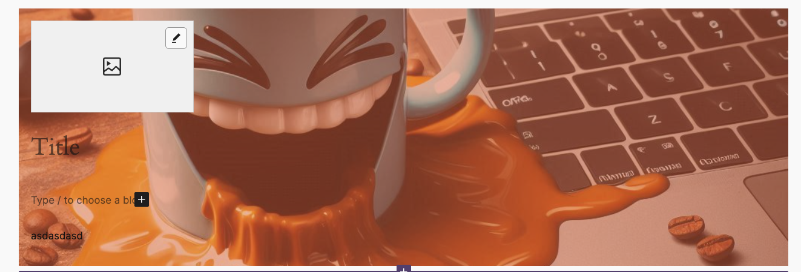

# Cover Link Block



Simple cover block with support:
- Background image
- Focal point
- Block link
- Overlay color
- Logo image
- Template for inner blocks
- Per Variation settings
- Allows resize logo width
- Content position control

[[toc]]

## 💡 Install via Composer:
```bash
composer require dekode-library/cover-link:*
```

## Usage

The block allows you to control what features are available using `library.json`.
And the block variation which also allows to have independent settings for each variation.
With per-variation settings, you can create variations that have different allowed inner blocks, templates, and other settings.

Settings are nested inside `settings`objects.

- `allowedInnerBlocks` - Array of allowed inner blocks.
- `template` - Array of inner blocks to be used as a template.
- `templateLock` - Whether the template is locked or not.
- `allowLink` - Whether the block can be linked to a URL.
- `allowLogo` - Whether the block has a logo.
- `hasFocalPoint` - Whether the block has a focal point.
- `hasOverlay` - Whether the block has an overlay.
- `allowContentPosition` - Whether the block allows content position control.

Each variation can have its own settings, which will override the default settings or inherit from default.

### Theme.json

Example settings for the block in `theme.json` and auto registered variations for the block.
```json
"dekode-library/cover-link": {
		"settings": {
			"allowedInnerBlocks": ["core/heading", "core/paragraph", "core/image"],
			"template": [["core/image", {}], ["core/heading", {}], ["core/paragraph", {}]],
			"allowLink": true
		},
		"variations": {
			"super-cool": { // This will be the variation namespace.
				// Everything expect settings are the variation metadata.
				"name": "video-card",
				"title": "Mega cover template",
				"icon": "media-video",
				"description": "A mega cover.",
				"settings": {
					"allowedInnerBlocks": ["core/image", "core/quote"],
					"template": [["core/image", {}], ["core/quote", {}]],
					"allowLink": false,
					"hasOverlay": false,
				}
			}
		}
	},
```

### Potential improvements
- Add support for background video.
- Add support for background gradient.
- Add height resize control.
- Add height resize control for mobile
- Add BG for mobile