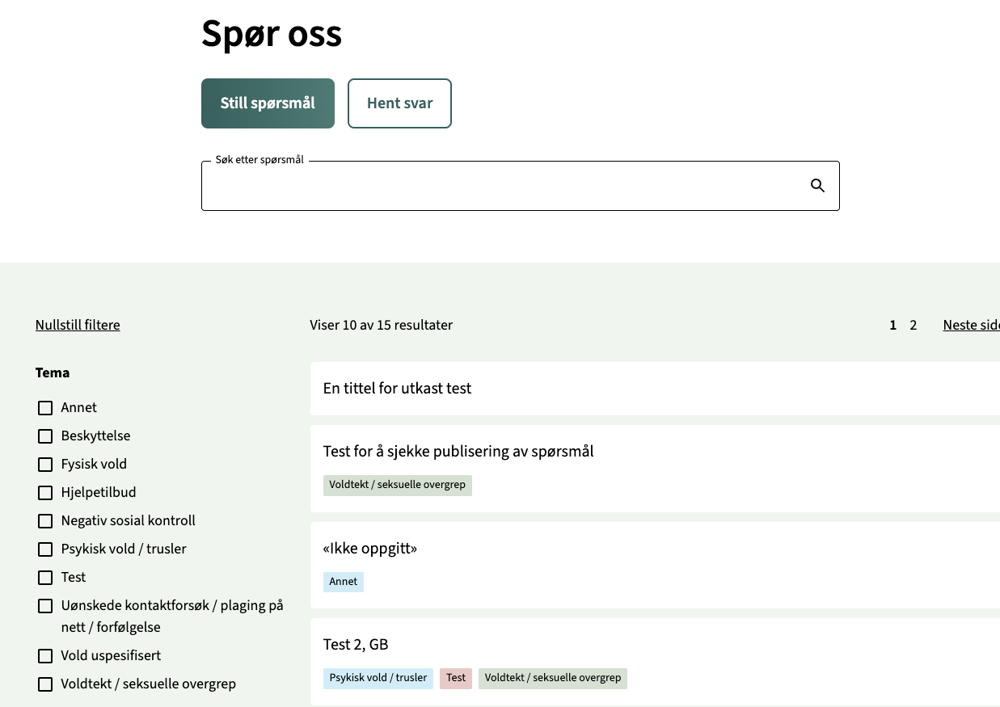

# Dekode QA



This plugin works as "ask anonymous questions" and "answer anonymous questions". When users ask questions they can tick a radio button for allowing the question to be published publicly or if the question and answer is only for them to see.

* New questions posted will be added for admin to read, edit, and respond to. 
* All questions (posts) will be password protected and admins can decide when to publish the question for other users to read.
* Questioners will be provided with a unique url to their question to revisit to see if any answer is given. 
* Questioners will also be provided with a unique code to lookup their question from a search question form.
* Admin can change the default name of the question post (defaults to the unique code). The post slug will be autmatically updateing using the title on save.
* Admin can potentially be notified by new questions adding email address(es) in the question form block.

Note: This plugin was made when working on this solution for NKVTS - Din utvei - Spør oss. The plugin is styled and added some javascript functionality specific for that project in a custom theme. Check out the theme in the [repository](https://github.com/DekodeInteraktiv/nkvts-new/tree/stage/packages/themes/dinutvei-theme) for details.

[[toc]]

## 💡 Install via Composer:
```bash
composer require dekode-library/dekode-qa:1.1.0
```

## Blocks
* "QA: Question Form": Question Form for users to submit questions
  * Attributes for setting text, error message, thank you page, email notification etc
* "QA: Code and url to question post": Display the question code and link to question post.
  * This needs to be added on a "Thank you" page
* "QA Post List": List QA posts which shows public questions and answers. 
  * Uses a template that uses query block with filters for search and terms
* "QA: Answer block": Add answer block to QA post.
  * Can be set to draft if not ready to be shown to questioners.
* "QA: Question block": Add question block to QA post
  * Should not be added manually. Will be created in the question post when a new question is submitted.
* "QA: Information for question post": Display information about the question post, e.g. old, not answered, not allow to publish etc.
  * Note: A question that a user has disagreed to being published publicly, is marked as "disallow publish", will not be  
* "QA: Search for submitted questions": Display a search box to find submitted questions.
  * Search for questions with unique code received when submitting a question
* "Taxonomy Filter": Allows users to filter by taxonomy terms when placed within a query loop block
  * Used in the QA Post List block to filter by terms 
* "QA Query Total": Display the query total results.
  * Used in the templates in QA Post List

## Post types
* `dekode_qa`: Post type for questions and answers
  * **Post meta**:
    * `qa_answered_time`: Datetime when the question is answered. 
      * Will be added automatically when an answer block is added and set to not draft. After the meta is saved a datetime picker is available in the post inspector so that the date and time can be adjusted manually.
    * `qa_question_edited`: Boolean
      * Toggle in the post inspector to set if the question is edited by the admin, e.g. removed private information or rewritten, fixed typos etc. 
  * Adds a column to the post list to show if and when the question is answered.

## Taxonomies
* `dekode_qa_gender`: Taxonomy for gender. Terms added here will be added as options in gender dropdown in the question form. You can set the order for the options in the dropdown with a checkbox "Order" when creating or editing a term.
* `dekode_qa_topics`: Taxonomy for Topics. Used as a filter in the frontend filterable post list. Also adds a label on the questiomn item in the post list. You can set a color for the topic checkbox "Color" when creating or editing a term. This adds a class to the label in frontend for the post list item (to be able to style topics in different colors).
* `dekode_qa_role`: Taxonomy for role. Used as a filter in the frontend filterable post list.
* `dekode_qa_time_period`: Taxonomy for time period. Used as a filter in the frontend filterable post list.
* `dekode_qa_category`: Taxonomy for generic category. Not used in frontend. Only for admins to create terms and tag as they like. Plan for this is to use for statistics.

## Filters
* `dekode_qa/qa_taxonomy/topic/colors`: Set the list of available colors for the `dekode_qa_topics` taxonomy. Default: Red, Green and Blue.
* `dekode_qa/qa_post_type/args`: Post type arguments for the `dekode_qa` post type.
* `query_filter/taxonomy/filter/render`: Filter the taxonomy query for the post list filter. 
* `query_filter/taxonomy/filter/query`: Filter for the tax query when using the taxonomy filter in the post list.
* `dekode_qa/qa_post_list/template`: Overwrite the default post list template.
* `dekode_qa/qa_post_list/template_topic`: Overwrite the default post list topic template.
* `dekode_qa/post_password_expires`: For how long the logged-in session for a password protected question post should last. Default `0` which then acts as a session cookie.
* `dekode_qa/qa_answer/responder`: The name for the responder showing up in the answer block. Default: Name of the WP site.
* `dekode_qa/qa_question_form/required_fields`: Used in rest when a question is submitted. Set the required fields from the form that should be checked. Default: `question` (the textarea for the question) and `allow-publish` for the radios agreeing to publish publicly or not. 
* `dekode_qa/qa_question_form/email_subject`: The subject for the email notifications when a new question has been submitted. Default: "New question submitted {wp_site_name}"
* `dekode_qa/automatically_publish_posts/enabled`: Automatically publish question and answer after a certain datetime. Default: `true`
* `dekode_qa/automatically_publish_posts/time_ahead`: Time after the answer is given before the post should be automatically published. Will only happen for questions that are set to be allowed to be published. Default: 2 weeks after answer time, in seconds.

## Actions
* `dekode_qa/create_question/before_set_password_cookie`: Action hook when setting the password cookie when submitting the question or subimtting the code to access the question. Argumnets: `$code`, `$secure`.

## Translations
* Translated to Norwegian using text domain `dekode-qa`.

## Roadmap
* Plan to add statistics. E.g. How many between the age of x and y has asked questions, what is the gender, average admin response time to answer etc.
