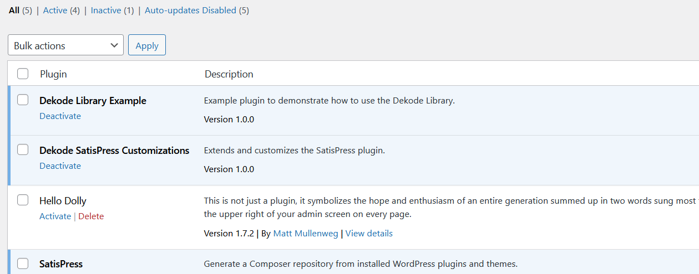

# Dekode SatisPress



This contains customizations for the SatisPress plugin, which the library is built on. This is not made for reuse elsewhere.

[[toc]]

## 💡 Install via Composer:
```bash
composer require dekode-library/dekode-satispress:1.0.0
```
