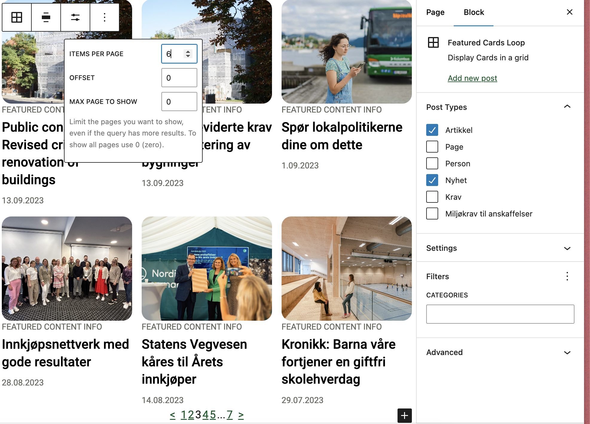

# QueryLoop: Featured Cards


Overrides the query loop block to work with T2 while also removing clutter. Supports multiple post types. Customizable through library.json.

[[toc]]

## 💡 Install via Composer:
```bash
composer require dekode-library/featured-cards-loop:2.0.1
```

## Customizing the block
This block can be customized using the `library.json` file. The following options are available:
- `__experimentalMultiplePostTypes` (bool): Whether to allow multiple post types. Default: `false`.
- `template` (array): The innerblocks template.
- `allowedControls` (array): The allowed controls for the block [See list](https://developer.wordpress.org/block-editor/how-to-guides/block-tutorial/extending-the-query-loop-block/#disabling-irrelevant-or-unsupported-query-controls), To see the post per page use `postCount` to see full list of available controls see the code as documentation is not complete [Link](https://github.com/WordPress/gutenberg/blob/f8f38b487d49b1fb27f55ed78a8d398ca7b56398/packages/block-library/src/query/edit/inspector-controls/index.js#L55)
- `defaultQuery` (array): The default query for the block.
- `defaultVariationTitle` (string): The title that will be outputted for the block.
- `defaultVariationDescription` (string): The description that will be outputted for the block.
- `allowedColumns` (array): The allowed columns for the block.

Example:
```json
{
	"__experimentalMultiplePostTypes": true,
	"template": [
		[
			"core/post-template",
			{
				"lock": {
					"move": true,
					"delete": true
				},
				"align": "full"
			},
			[["t2/featured-template-post"]]
		],
		[
			"core/query-pagination",
			{
				"lock": {
					"move": true,
					"delete": true
				},
				"align": "center",
				"layout": {
					"type": "flex",
					"justifyContent": "center",
					"flexWrap": "wrap"
				}
			},
			[
				[
					"core/query-pagination-previous",
					{ 
						"label": "<",
						"lock": {
							"move": true,
							"delete": true
						}
					}
				],
				[
					"core/query-pagination-numbers",
					{
						"lock": {
							"move": true,
							"delete": true
						}
					}
				],
				[
					"core/query-pagination-next",
					{
						"label": ">",
						"lock": {
							"move": true,
							"delete": true
						}
					}
				]
			]
		]
	],
	"allowedControls":  ["search", "taxQuery", "postType", "postStatus", "orderBy", "order", "postsPerPage"],

	"defaultVariationTitle": "Featured Cards Loop",
	"defaultVariationDescription": "Display a loop of featured cards.",
	"allowedColumns": [3, 4, 6, 12]
}
```
