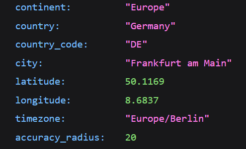

# Geolocation



Uses a MaxMind GeoIP database to provide geolocation functionality, with helper functions to get coordinates, city and/or country.

By default this plugin does little. It provides one REST endpoint at `/wp-json/geolocation/v1/location` and updates the GeoIP database file on a weekly schedule, it must be used by your code.

[[toc]]

## 💡 Install via Composer:
```bash
composer require dekode-library/geolocation:1.0.1
```

## Requirements

To download/update the GeoIP database requires an account with MaxMind, which you can use to get the account ID and license key. The plugin then uses these to download databases.

Please add these to your `.env`:

```bash
MAXMIND_ACCOUNT_ID=000000
MAXMIND_LICENSE_KEY=abcdef
```

## REST API

You can make requests via client JavaScript to `/wp-json/geolocation/v1/location` and it will return data:

On success:

```json
{
  "continent": "Europe",
  "country": "Germany",
  "country_code": "DE",
  "city": "Frankfurt am Main",
  "latitude": 50.1169,
  "longitude": 8.6837,
  "timezone": "Europe/Berlin",
  "accuracy_radius": 20
}
```

On failure:

```json
{
  "error": "No location data found for IP address."
}
```

## Direct Usage

```php
use Library\Geolocation\Lookup;

$lookup = Lookup::getInstance();

try {
    $record = $lookup->city();
} catch ( \Throwable $e ) {
    \error_log( 'GeoIP Lookup Failed: ' . $e->getMessage() );
    return new \WP_REST_Response( [ 'error' => 'No location data found for IP address.' ], 404 );
}

$country   = $record?->country?->name ?? 'n/a';
$city      = $record?->city?->name ?? 'n/a';
$latitude  = $record?->location?->latitude ?? 0.0;
$longitude = $record?->location?->longitude ?? 0.0;
```
