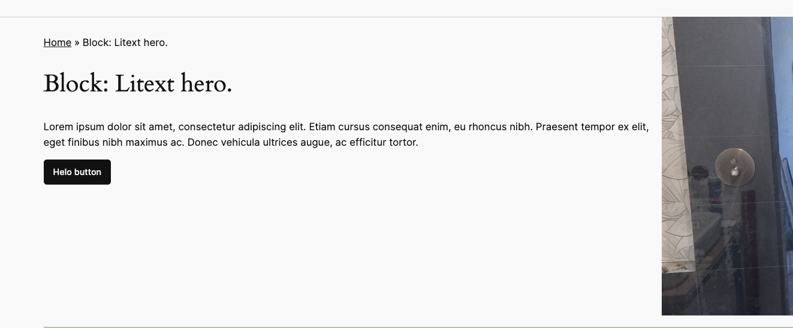

# Yet another hero block.



The block utilizes the yoast breadcumbs if installed and post title.
Allows to set a background image.
Allows to set light or dark theme as it was part of the design and there was no need for more complexity.
Will display featured image on the side if used.

Orignally developed for Litex design.

[[toc]]

## 💡 Install via Composer:
```bash
composer require dekode-library/hero-lx:1.2.1
```

## Filters
- `dekode-library/hero-lx/featured-image-size` - Filter to change the size of the featured image. Default `large`.
- `dekode-library/hero-lx/background-image-size` - Filter to change the size of the background image. Default `1536x1536`.
- `dekode-library/hero-lx/wrapper-classes` - Before classes are added to the wrapper.
- `dekode-library/hero-lx/attributes` - Before attributes are used.
- `dekode-library/hero-lx/attributes/{post_type}` - Before attributes are used for a specific post type.
- `dekode-library/hero-lx/featured-image` - featured image html.
- `dekode-library/hero-lx/breadcrumbs` - breadcrumbs html.
- `dekode-library/hero-lx/background-image` - background image html.
- `dekode-library/hero-lx/template-render` - rendered html with proviced args, and elements and content