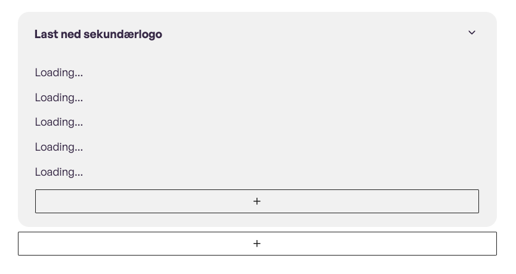

# Lazy Load blocks in editor


A simple plugin to lazy load blocks in the editor. This is useful for blocks that are heavy on serverside rendering or making a lot of API calls.

[[toc]]

## 💡 Install via Composer:
```bash
composer require dekode-library/lazy-load-editor:*
```

## Library.json
You can customize the 
```
{
	"dekode-library/lazy-load-editor": {
		"blocks": {
			"t2/files": {
				className: "t2-file-item t2-file-item__link",
			},
			"t2/file-item": {
				className: "t2-file-item t2-file-item__link",
			},
		}
		"threshold": 0.1,
		"delay": 1500,   // Delay between each load
		"loadingPlaceholder": "Loading...",
		"preloadDistance": 1000, // Distance from the viewport to start loading
		"maxConcurrentLoads": 8, // Maximum number of concurrent loads
	}
}
```