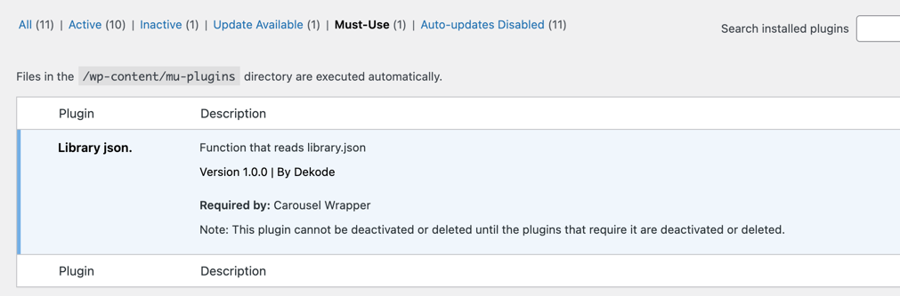

# Library.json


This is a simple plugin that reads the library.json file in your theme.
It works the same as t2.json, where it reads the main theme first and then the child theme.
In the dekode-library repo, you can find get-library-config component, which helps getting library.json stuff in javascript.
[[toc]]

## 💡 Install via Composer:
```bash
composer require dekode-library/library-json:1.0.0
```
