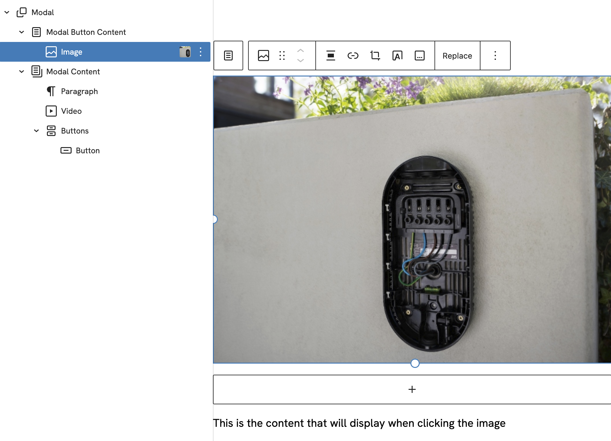

# Modal Wrapper


A wrapper block to make a modal open on click with your desired inner blocks. You can also filter the modal content to dynamically change the content. Both backend and frontend needs to be styled depending on your needs.

[[toc]]

## 💡 Install via Composer:
```bash
composer require dekode-library/modal-wrapper:*
```

## Attributes
* `dekode-library/modal-button`
  * `allowedInnerBlocks` - An array of allowed inner blocks. Can be modified with a block variation.
  * `template` - A template to use for the modal content. Can be modified with a block variation.


* `dekode-library/modal-content`
  * `allowedInnerBlocks` - An array of allowed inner blocks. Can be modified with a block variation.
  * `template` - A template to use for the modal content. Can be modified with a block variation.
  * `lockScroll` - Locks the scroll of the page when the modal is open.
  * `hideInEditor` - Hides the modal content in the editor, useful in cases where the content is server-side rendered from the filter.

## Filters
`modal_wrapper_content` Allows you to filter the content of the modal wrapper.
* `$content` - The content of the modal wrapper.
* `$block` - The WP_Block object.

`modal_wrapper_close_button` Allows you to filter the close button html inside the modal.

## Example on how you can implement it in a T2 featured single post template.
```html
<!-- wp:dekode-library/modal-wrapper -->
	<!-- wp:dekode-library/modal-button -->
		<!-- wp:t2/post-featured-image { "fallbackImage": "/content/themes/defa-theme/assets/placeholder.svg"} /-->
		<!-- wp:group {"align":"full","layout":{"inherit":false}} -->
		<div class="wp-block-group alignfull">
			<!-- wp:t2/post-title /-->
		</div>
		<!-- /wp:group -->
	<!-- /wp:dekode-library/modal-button -->

    <!-- wp:dekode-library/modal-content { "lockScroll": true, "hideInEditor": true } /-->
<!-- /wp:dekode-library/modal-wrapper -->
```

## Example on how to filter the modal content.
```php
/**
 * Show the post content inside the modal.
 *
 * @param string $content The content.
 * @param WP_Block $block The block.
 * @return string
 */
function modal_wrapper_content( string $content, \WP_Block $block ) {
	// return early if we are in the editor.
	if ( \is_admin() ) {
		return $content;
	}

	$post_id = $block->context['postId'] ?? null;

	if ( ! $post_id ) {
		return $content;
	}

	$post_content = apply_filters( 'the_content', get_post_field( 'post_content', $post_id ) );

	if ( ! $post_content ) {
		return $content;
	}

	return $post_content;
}
```