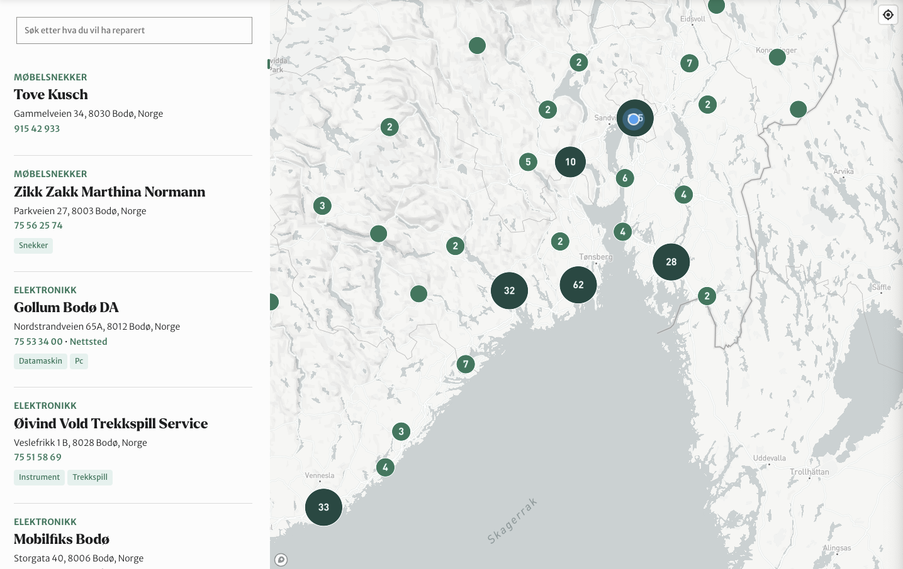

# Organizations Map


Map for displaying organizations on a map.

[[toc]]

## 💡 Install via Composer:
```bash
composer require dekode-library/organizations-map:2.2.5
```

## Mapbox token
You will need to set MAPBOX_TOKEN in your .env file and wp-config.php to use this block. You can get a token from [Mapbox](https://www.mapbox.com/).

## Customizing fields
You can customize the fields used to display information by adding the `fields` property to the theme.json file. The `fields` property is an array of objects with the following properties:

- `name` (string) - The name of the post meta.
- `label` (string) - The label of the field, displayed in the block editor.
- `type` (string) - The type of the input field. Available fields:
	- `text` - A single line text input.
	- `email` - Same as `text`, just generates an `mailto:` url on the frontend.
	- `tel` - Same as `text`, just generates a `tel:` url on the frontend.
	- `url` - Same as `text`, just generates a url link on the frontend.
	- `textarea` - A multi line text input.
	- `toggle` - A toggle switch.
	- `image` - An image input.
- `position` (string) - Where the info should be displayed.
  - `top` - Displayed at the top, right below the title.
  - `contact` - Displayed in the contact section.
  - `bottom` - Displayed under the contact section.

## Customizing the clusters
You can customize the clusters by adding the `clusters` property to the theme.json file. The `clusters` property is an array of objects with the following properties:

- `colors` (object) - An object with the following properties:
  - `text` (string) - The color of the text inside the cluster.
  - `circle` (string) - The color of the cluster circle.
  - `circleStroke` (string) - The color of the cluster circle stroke.
  - `circleSelected` (string) - The color of the selected cluster circle.
  - `circleStrokeSelected` (string) - The color of the selected cluster circle stroke.
- `steps` (array) - An array of objects with the following properties:
  - `color` (string) - The color of the cluster when it reaches the step.
  - `step` (number) - The step at which the color should be applied.
  - `size` (number) - The size of the cluster when it reaches the step.

## Customizing the information
You can customize the title, placeholder like this in the theme.json.
- `title` (string) - The title of the block.
- `placeholder` (string) - The placeholder of the search input.


## Example theme.json
```javascript
/**
 * Block dekode-library/organizations-map settings.
 */
export default {
	custom: {
		fields: [
			{
				name: 'phone',
				label: 'Phone',
				type: 'tel',
				position: 'contact',
			},
			{
				name: 'email',
				label: 'Email',
				type: 'email',
				position: 'top',
			},
			{
				name: 'website',
				label: 'Website',
				type: 'url',
				position: 'contact',
			},
		],
		title: 'Fibo Partner',
		placeholder: 'Search for a Fibo Partner',
		clusters: {
			colors: {
				text: '#fff',
				circle: '#152534',
				circleStroke: '#59dee8',
				circleSelected: '#59dee8',
				circleStrokeSelected: '#152534',
			},
			steps: [
				{
					color: '#2a566e',
					step: 2,
					size: 15,
				},
				{
					color: '#25485f',
					step: 5,
					size: 10,
				},
				{
					color: '#1f3a51',
					step: 10,
					size: 15,
				},
				{
					color: '#1a2d42',
					step: 20,
					size: 20,
				},
				{
					color: '#152534',
					step: 200,
					size: 25,
				},
			],
		},
	},
};
```

## Hooks and filters
You can use the following hooks and filters to customize the block:

- `dekode-library/organizations-map/post_type_name` - Fitler post type name.
- `dekode-library/organizations-map/post_type_args` - Fitler post type args e.g labels.
- `dekode-library/organizations-map/taxonomy_args` - Fitler taxonomy args e.g labels.
- `dekode-library/organizations_map/fields_top` - Filter fields displayed at the top.
- `dekode-library/organizations_map/fields_contact` - Filter fields displayed in the contact section.
- `dekode-library/organizations_map/fields_bottom` - Filter fields displayed at the bottom.
- `dekode-library/organizations_map/field_html` - Filter the field html.
- `dekode-library/organizations_map/partner_html` - Filter the partner html (displayed in map sidebar).
- `dekode-library/organizations_map/fields/image_size` - FAllow to filter the image size for the partner image meta field output. Default is `medium`.

### Templating.
The plugins allow you to place custom template inside theme directory to override the default template.

use `dekode-library\organizations-map\template-partner` to override the partner template in the map sidebar.
Inside template you have access to:
- `$fields_contact`
- `$fields_top`
- `$fields_bottom`
- `$block_fields` - All fields formatted and after the `dekode-library/organizations_map/field_html` filter.
- `$main_category_html`

The tempalte is required inside wp post loop, wihich also means you can use `get_the_ID` to get any post meta you want and format it as you want.

The required template goes through the `do_blocks` function to render the blocks inside the template.

The template will be included inside `li` element with correct data set for the map.


## Multilanugage

The plugin supports multilanguage based on Pollylang.
The map language is set baed on current viewed langauge.

The map will fetch markers based on language unless the markers are not set to translatable in the Pollylang settings.
