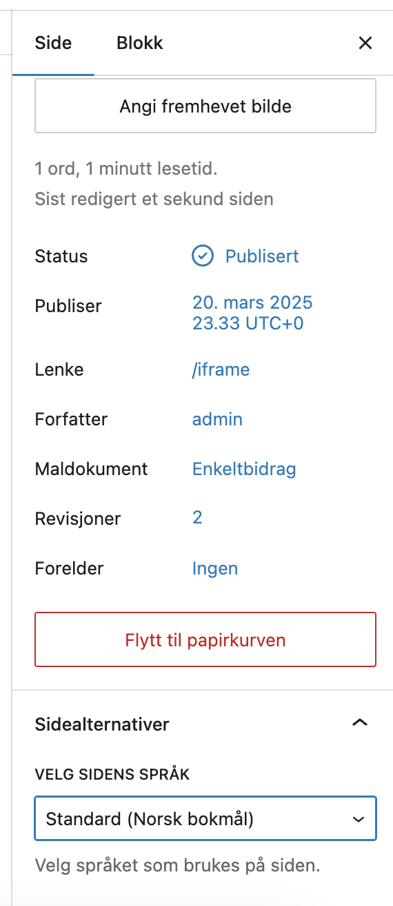
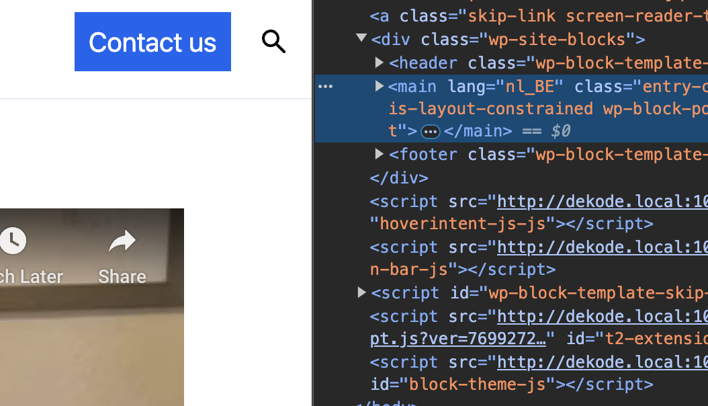

# Page Language (Meta Option)



A plugin that allows you to assign a language on a per-page (or custom post type) basis via the Block Editor. Useful for multilingual websites or custom language-based behavior.

[[toc]]

## 💡 Install via Composer:
```bash
composer require dekode-library/page-language:1.0.0
```

## Features

- Adds a "Select page language" dropdown to the Page Settings sidebar in the Block Editor.
- Supports multiple post types via a WordPress-style filter (PHP or JavaScript).
- Fetches installed languages from WordPress core.
- Default label reflects the site's default language.
- Fully translatable and extensible.
- Adds lang attribute to core/post-content block.

---

## Usage

Once activated, this plugin adds a **"Page Options"** panel in the Block Editor sidebar for supported post types. From there, editors can select a language for the current post.

The selected language is stored in the post meta key: `dekode_page_language`.

---

## JavaScript Integration

This feature is powered by a custom plugin registered with the Block Editor using the `@wordpress/plugins` API.

### Dynamic Options

The list of available languages is dynamically injected into JavaScript from the PHP backend using `wp_add_inline_script`.

The injected variable is available globally as:

```js
dekodePageLanguageOptions;
```

You can use the `@wordpress/hooks` filter `dekodeLibrary.pageLanguage.supportedPostTypes` to allow the language panel on other post types:

```js
import { addFilter } from '@wordpress/hooks';

addFilter(
    'dekodeLibrary.pageLanguage.supportedPostTypes',
    'my-plugin/extend-supported-post-types',
    (postTypes) => [...postTypes, 'post', 'custom_post_type']
);
```

---

## Filters (PHP)

### `dekode_library/page_language/supported_post_types`

Allow support for additional post types beyond just `page`.

```php
add_filter( 'dekode_library/page_language/supported_post_types', function( $post_type ) {
	return [ 'page', 'custom_post_type' ]; // Support multiple post types
});
```

Allow support for all custom post types.

```php
add_filter( 'dekode_library/page_language/supported_post_types', function( $post_type ) {
	return '';
});
```

---

### `dekode_library/page_language/available_languages`

Modify or extend the list of languages shown in the dropdown.

```php
add_filter( 'dekode_library/page_language/available_languages', function( $languages ) {
	// Example: Add a custom test language
	$languages[] = [
		'label' => 'Dutch (Belgium)',
		'value' => 'nl_BE',
	];
	return $languages;
});
```

---

## Localization

- Text domain: `dekode-page-language`
- Place translations in the `/languages` directory.~~

---

## Example Output in Editor

Admin


Frontend


