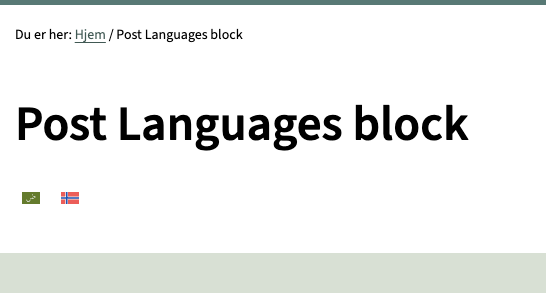

# Post languages block


A block that will show the languages that the post is available in. It can show the flag and the language name.

[[toc]]

## 💡 Install via Composer:
```bash
composer require dekode-library/post-languages:1.2.2
```

## Available settings
This block can be customized using the `library.json` file. The following options are available:
- `plugin` (string): The language plugin to use. Available options are `wpml` and `polylang`.
- `displayNames` (bool): Whether to display the language names. Default: `false`.
- `tag` (string): The tag to wrap the languages in. Default: `ul`.
- `innerTag` (string): The tag to wrap each language in. Default: `li`.

## Example library.json
```json
{
    "dekode-library/post-languages": {
        "plugin": "polylang",
		"displayNames": false,
		"tag": "ul",
		"innerTag": "li",
		"allowed_icons": ["flag_en", "flag_no"]
    }
}
```

## Filters
The block offer a filter to modify the languages array, allowing you to modify the names or swap out the flag image.

`dekode_post_languages` - Modify the languages array. The filter receives the following arguments:
- `$languages` (array): The languages array.
- `$post_id` (int): The post ID.
- `$plugin` (string): The language plugin.