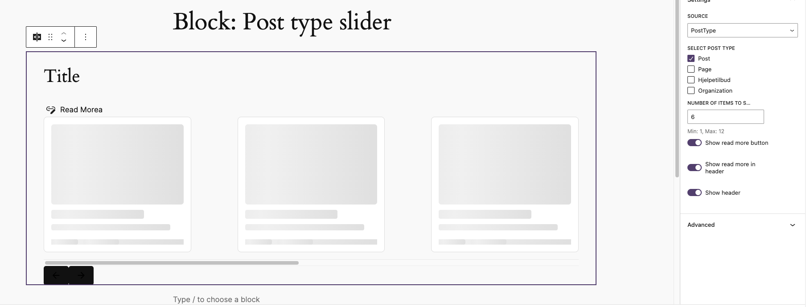
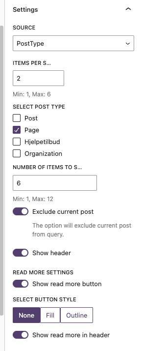
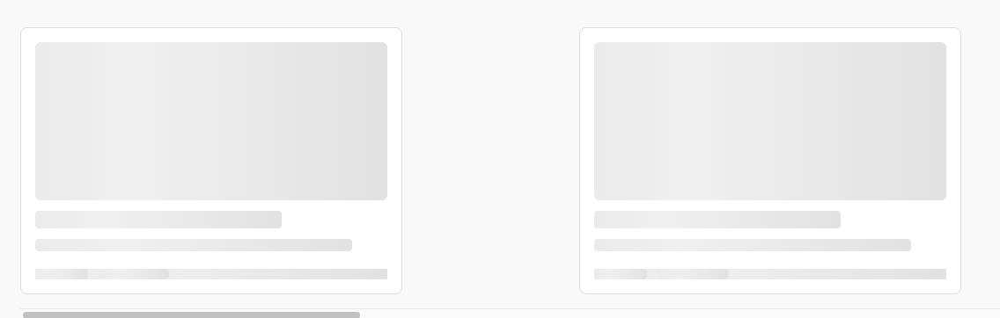

# Post type scroll



Show post types in a scrollable list.
Based on the dekode.no scroll component.

[[toc]]

## 💡 Install via Composer:
```bash
composer require dekode-library/post-type-scroll:1.1.0
```

## The block
The block allows you to select posts or select post type and display assigned posts in a scrollable swiper based list.

The block uses T2 Featured card layout to display the posts.

### The block allows to control
- Post type to fetch posts from
- Manually select posts
- Exclude current post from query if post type is selected.
- The number of posts to show
- The number of posts to show in the slider
- Show or hide the block title
- Add custom more link
- Placement of read more link (top/ bottom)
- Read more button style - based on registered core button styles.

#### NOTE:
*In backend icon is not rendered as for now!*
Button style in backend may be rendered incorrectly as WP does not apply those same way as in frontend, can be poliffilled by adding button styles to editor styles.

## Filters and hooks
Note: block_args are not the same as raw block attributes. As they are parsed using `wp_parse_args` with defaults.

- `'dekode-library/post-type-scroll/args', $args, $block_args` - Filter to modify the block_args before passed to the block.
- `'dekode-library/post-type-scroll/query', $default_query_args, $block_args,` - Filter to modify the query args before passed to `get_posts` (in case of NOT manuall select)
- `'dekode-library/post-type-scroll/ids', $ids, $block_args` - Filter to modify manually picked ids before used.
- `dekode-library/post-type-scroll/read-more/icon` - Filter to modify the icon used for read more link. Default is `arrowForward`.
- `dekode-library/post-type-scroll/read-more/use-icon` - Filter to modify if icon should be used for read more link. Default is `true`.
- `dekode-library/post-type-scroll/swiper/arrow-left` - Filter to modify the left arrow icon used for swiper. Default is `arrowBack`.
- `dekode-library/post-type-scroll/swiper/arrow-right` - Filter to modify the right arrow icon used for swiper. Default is `arrowForward`.

### Block settings
This may look different depending if was leter on updated or not.



### Preloading
Block uses preloaders to not look ugly when posts are loading.
When loaded it will use T2 featured card layout to display the posts.




## TODO
- [ ] Add support for multiple post types select
- [ ] Support for more complex query selection
- [ ] Better editor UI.
- [ ] When ids are selected make better order than current :D
- [ ] Add read more T2 Icon picker instead of PHP filter
- [ ] Add navigation T2 Icon picker instead of PHP filter
- [ ] Extend swiper settings in block. (autoplay, speed, etc)
- [ ] Allow to apply same filters to backend as frontend.
- [ ] Pass to the cards the site id to make it work with multisite.
- [ ] Allow to multisite queries (e.g select posts from other sites, sites etc ...)