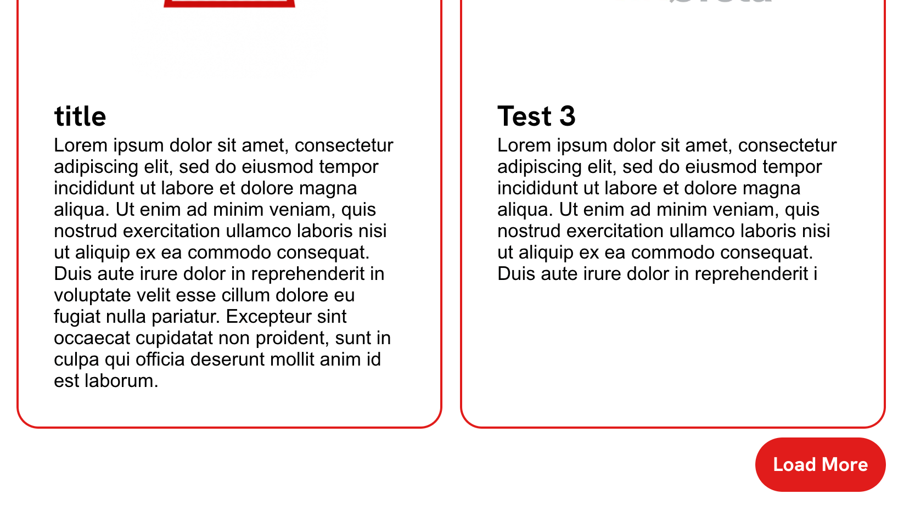

# Query Load More


Adds a button to load more posts to the Query Loop block. Text is customizable and uses the same classes as buttons.
[[toc]]

## 💡 Install via Composer:
```bash
composer require dekode-library/query-load-more:1.0.1
```
