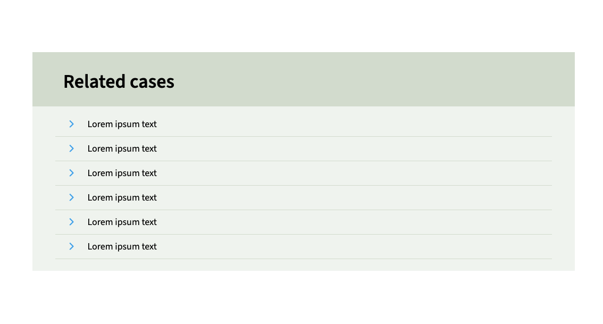

# section with heading block


A simple block with heading and content. The heading color is customizable in the editor.

[[toc]]

## 💡 Install via Composer:
```bash
composer require dekode-library/section-with-heading:1.0.0
```

## Library.json
You can customize the backgroundColor, textColor, headingColor, template and allowed innerblocks in library.json. Example:
```
{
	"dekode-library/section-with-heading": {
		"template": [
			["t2/link-list"]
		],
		"allowed_blocks": ["core/paragraph", "t2/link-list"],
		"backgroundColor": "#f3f3f3",
		"textColor": "#333",
		"headingColor": "#333"
	}
}
```