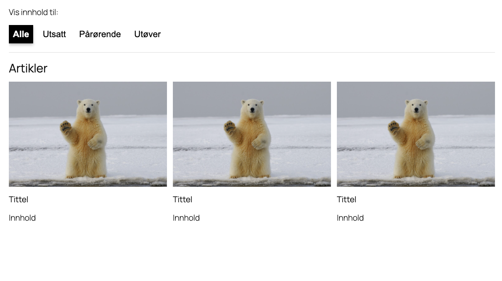

# Tabs Block


Display related content in a compact tab. Originally forked out of T2

[[toc]]

## 💡 Install via Composer:
```bash
composer require dekode-library/tabs:1.1.6
```

## Library.json
You can customize the justification, template and allowed blocks.
```
{
	"dekode-library/tabs": {
		"template": [
			["core/paragraph"]
		],
		"allowedBlocks": ["core/paragraph", "t2/link-list"],
		"allowChangingTabsJustification": true
	}
}
```

### Frontend hooks

The add custom frontend hook: `onLibraryTabChange` to listen for tab changes.

```js
document.addEventListener('onLibraryTabChange', function(event) {
	console.log('Tab changed', event.detail);
});
```

The `deta` object contains the following properties:
- `tabId` - The ID of the tab that was clicked
- `tab` - The DOM element of the tab that was clicked
- `panel` - The DOM element of the panel that was shown.