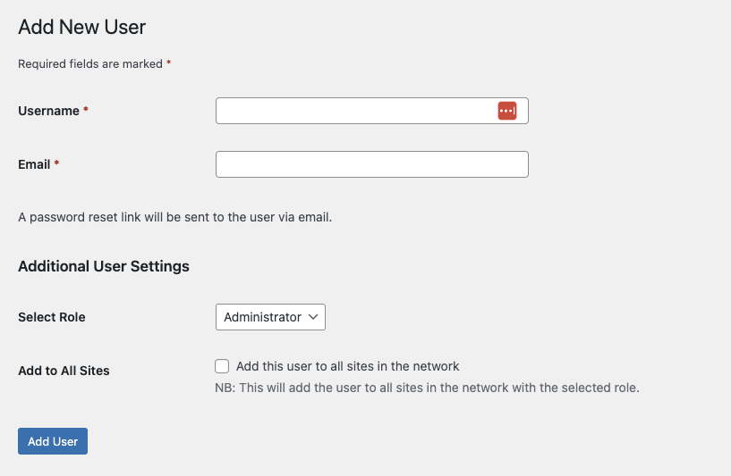

# User Manager


A very simple user manager for a WordPress, the idea is to expand this with helpers for user management.

[[toc]]

## 💡 Install via Composer:
```bash
composer require dekode-library/user-manager:*
```

## Features
* Assigning role when creating a user in a multisite.
* Checkbox for adding users to all subsites.