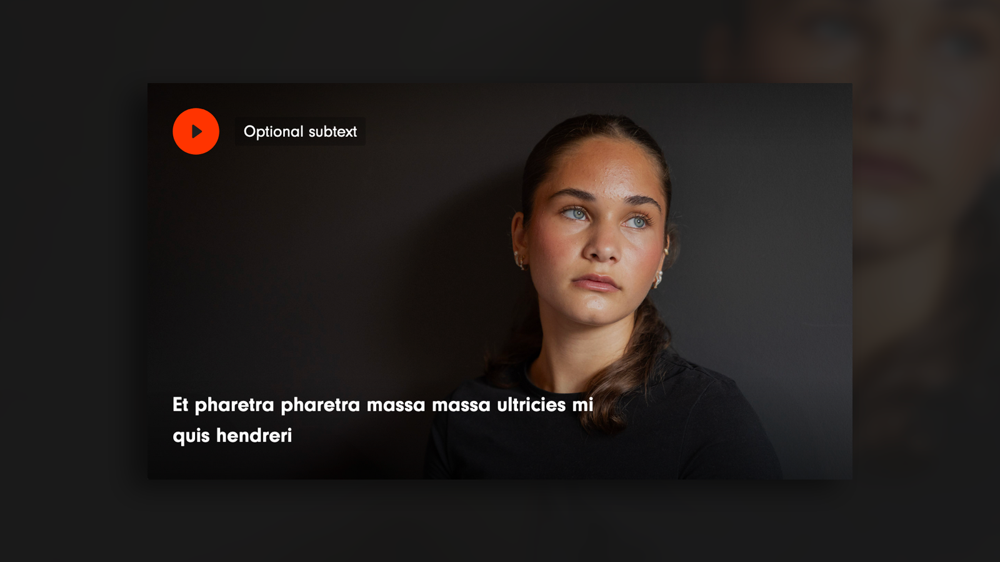

# Video player



This block adds an overlay with a title and subtitle to an embedded video, making it more engaging and informative.
Additionally, the user can select an image, set the focus on that image, as well as define the aspect ratio.

The icon used for the overlay is registered via T2 under the name `videoPlayerIcon` allowing it to be modified according to the design.

You can use the hook `dekode_library_video_player_align` to modify the allowed width for this block. By default, all widths are available (_content, wide, and full_)


[[toc]]

## 💡 Install via Composer:
```bash
composer require dekode-library/video-player:2.0.0
```
